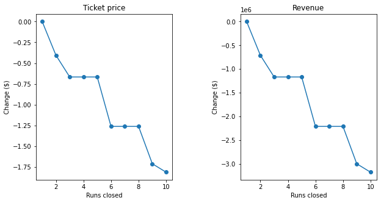

% Big Mountain Resort Pricing Analysis

# Problem

- Increased operating costs of $1.5 million for new lift
- Old pricing strategy: charge a little more than average of market segment
- Big Mountain is *much bigger* than most resorts: are we leaving money on the table?
- How could proposed cost reductions or improvements change pricing support?

# Findings

## What drives ticket prices?

The most important features associated with higher ticket prices are:

- Vertical drop
- Snowmaking area
- Total number of chairs
- Total number of runs

# Findings

## Big Mountain is rich with the features other resorts charge more for.

# Findings

## Big Mountain's amenities support a higher ticket price. 

- Big Mountain's Adult Weekend tickets are $81
- Its amenities support a price of $96
- Increasing ticket prices could increase revenue by $2.6 million

# Proposed changes

## Adding a run to increase vertical drop could support a higher ticket price.

- Adding a run to increase vertical drop by 150 feet would increase support for ticket price by about $2
- Adding 2 acres of snow making to cover this area would make no difference

# Proposed changes

## Closing a few runs has a small impact on support for ticket pricing, but closing 6 or more would lead to a large drop.

- Closing one run would make no difference
- Closing 3—5 runs could decrease support for ticket price by a little over $1
- Closing 6 or more could lead to a large drop

*The impact of closing runs*

# Method

We analyzed the factors associated with ticket pricing at 276 ski resorts in the United States to determine how size, location, and amenities predict ticket prices. Building on this analysis, we developed a model that allows us to estimate what changes would support higher prices.

