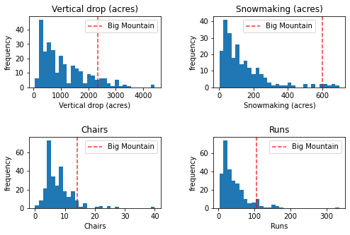
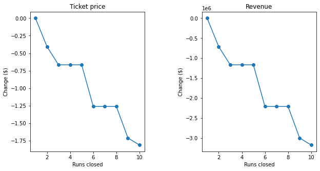

# Guided Capstone Project Report

## Problem

Big Mountain Resort is spending $1.5 million more this season in operating costs to operate its new chair lift, and management is not sure that its pricing strategy reflects the quality of its offerings. At the same time, it is considering ways to reduce costs or make changes that would support higher ticket prices. 

## Method

We analyzed the factors associated with ticket pricing at 276 ski resorts in the United States to determine how size, location, and amenities predict ticket prices. Building on this analysis, we developed a model that allows us to estimate what changes would support higher prices.

## Findings

### Big Mountain charges less than similar resorts.

The most important features associated with higher ticket prices are vertical drop, snowmaking area, the total number of chairs (especially Fast Quads), and the number of runs. Barring a few outliers, Big Mountain is near the top of the distribution for all of these features:

*Compared to other American resorts, Big Mountain has one of the highest vertical drops, snowmaking capacity, number of chairlifts, and number of runs. These qualities drive ticket prices more than any other features.*

Based on our model, a resort of size and amenities similar to Big Mountain should charge approximately $96 (with uncertainty ±$6) for adult weekend tickets, significantly more than Big Mountain's current price of $81. If Big Mountain were to charge $96 and maintain its current average of 350,000 visitors who purchase 5 tickets each on average, revenues would increase by $2.6 million.

### Adding a run to increase vertical drop could support a higher ticket price.

Our model predicts that adding a run to increase vertical drop by 150 feet would increase support for ticket price by about $2. Adding 2 acres of snow making to cover this area would make no difference.

### Closing a few runs has a small impact on support for ticket pricing, but closing 6 or more would lead to a large drop.

Our model predicts that closing one run would make no difference, closing 3—5 runs could decrease support for ticket price by a little over $1, and closing 6 or more could lead to a large drop.

*Closing one run makes no difference, but closing more than 6 runs would lead to a large drop in ticket price support.*
